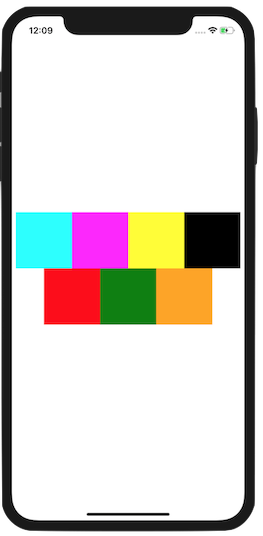

# FlexBox (React Native)

Beispiel-App für den Abschnitt über das FlexBox-Layout des [Video-Kurses zu React Native](https://www.udemy.com/react-native-einstieg/)

1. Projekt clonen oder herunterladen: `git clone https://github.com/behrends/FlexBox.git`
1. Ins Projektverzeichnis wechseln: `cd FlexBox`
1. npm-Packages für das Projekt installieren: `npm install`
1. React Native Packager starten mit `expo start` 

